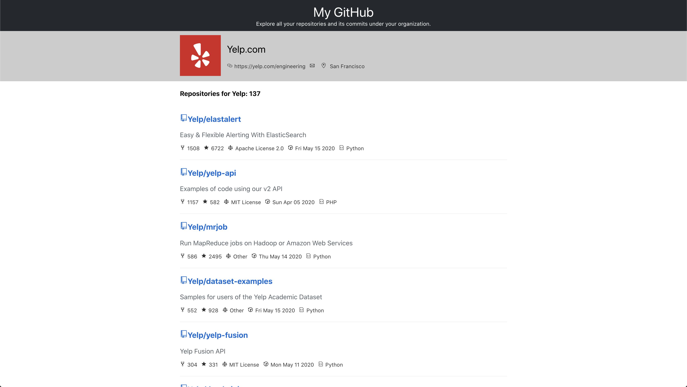
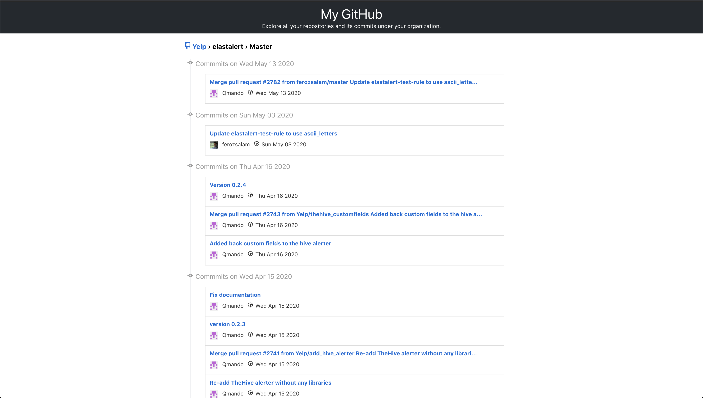

# My GitHub WebApp - by Maulik Suchak
* Project: *Public web app for users to browse projects under certain organizations and its commits.*
* Language/Frameworks: *JavaScript(with React) + SCSS*

## Howdy! 👋

Hey there, this is Maulik Suchak.






## Features Implemented as MVP

* Listing of all the repositories sorted by number of forks. "Elastic Search" has the heighest no. of forks in Yelp.
* Smooth or infinite scroll to load more repositories in home page or Projects page.
* By default it loads all repos from "Yelp" org but user can type in after '/' inside address bar to load any other org. e.g. '/Yelp'.
* Clicking on title of repo will take you to the list of commits page and show most recent commits.
* User can also load previous/older commits by clicking on the buttons in the bottom.

## Possible Enhancements

* [UX] More unit and integration tests.
* [UX / Tech] Graceful degradation to support non-modern browser.
* [UX] Instead of having user to type in the browser address bar to load perticular org, add a search box in the header.
* [Tech] Better SCSS organziation by using mixins, variable, etc.


## Setup & Development

### Prerequisite
* Make sure you have `node` installed -- recommended `6.4.1`.
* Once you have a `node` installed, run `npm install` in this repo to get your dependencies.
* (optional) `npm run build` to create build folder.

In the project directory, you can run:

### `npm start`

Runs the app in the development mode.<br />
Open [http://localhost:3000](http://localhost:3000) to view it in the browser.

The page will reload if you make edits.<br />
You will also see any lint errors in the console.

### `npm test`

Launches the test runner in the interactive watch mode.<br />
See the section about [running tests](https://facebook.github.io/create-react-app/docs/running-tests) for more information.

### `npm run build`

Builds the app for production to the `build` folder.<br />
It correctly bundles React in production mode and optimizes the build for the best performance.

The build is minified and the filenames include the hashes.<br />
Your app is ready to be deployed!

See the section about [deployment](https://facebook.github.io/create-react-app/docs/deployment) for more information.

## Technical Details

### Src Structure / Components
```
src
├── index.js
├── App.css
├── App.js
├── Components
|   └── Commits
|       ├── Commits.scss
|       ├── CommitGroup.jsx
|       ├── CommitRow.jsx
|       ├── CommitHead.jsx
|       ├── index.jsx
|   └── Error
|       ├── Error.scss
|       ├── index.jsx
|   └── Footer
|       ├── Footer.scss
|       ├── index.jsx
|   └── Header
|       ├── Header.scss
|       ├── index.jsx
|   └── Loading
|       ├── Loading.scss
|       ├── index.jsx
|   └── NoMatch
|       ├── index.jsx
|       ├── NoMatch.scss
|   └── Projects
|       ├── index.jsx
|       ├── ProjectRow.jsx
|       ├── Projects.scss
|       ├── ProjectTop.jsx
public
├── index.html
```

### Description / Data Flow / Approach
* Overall, this app has 2 pages. a. Lists all repos sorted by forks. b. List all commits under a repo.
* This project was bootstrapped with [Create React App](https://github.com/facebook/create-react-app). Reason: wanted to move quickly since this structure will give me minimum things I'd need to create a MVP.
* It makes an API call to fetch all the projects in the beginning (defaults to "Yelp" if it address bar has "/").
* Then, it does fetches organization details to display all the meta data by making another GET HTTP request. If user types in '/Yelp', it'll fetch all repo under Yelp account instead of loading default Yelp.
* Tried to use minimal CSS to move quickly. Used SCSS to create better org structure.

### Some Manual Test Cases

Couldn't write due to time constraints

*Projects / Homepage*
* Requesting '/' (homepage) -> Should show all the projects under Yelp
* Requesting '/Yelp' (homepage) -> Should show all the projects under Yelp
* Click on the link of a project -> Should open all the commits of the project
* Scroll -> Scrolling in the homepage should load more projects

*Commits Page*
* Click on Older & Newer should work -> Click on the buttons below should fetch more commits

### API
* [/search/repositories](https://developer.github.com/v3/search/): Search all repo under an org. You could request already sorted result from this end point which is pretty powerful. For example, sorted by forks or stars, etc.
* [/orgs/:org](https://developer.github.com/v3/orgs/#get-an-organization): This fetches particular org details used to display on the top of the page.
* [/repos/:owner/:repo/commits](https://developer.github.com/v3/repos/commits/#list-commits-on-a-repository): Fetches all the commits under particular repo. Used to display result inside Commits page.

Thank you!
